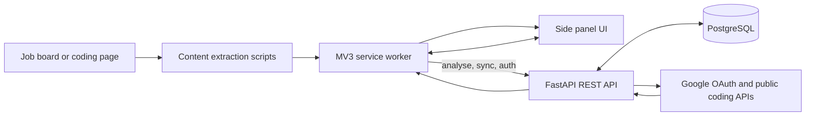
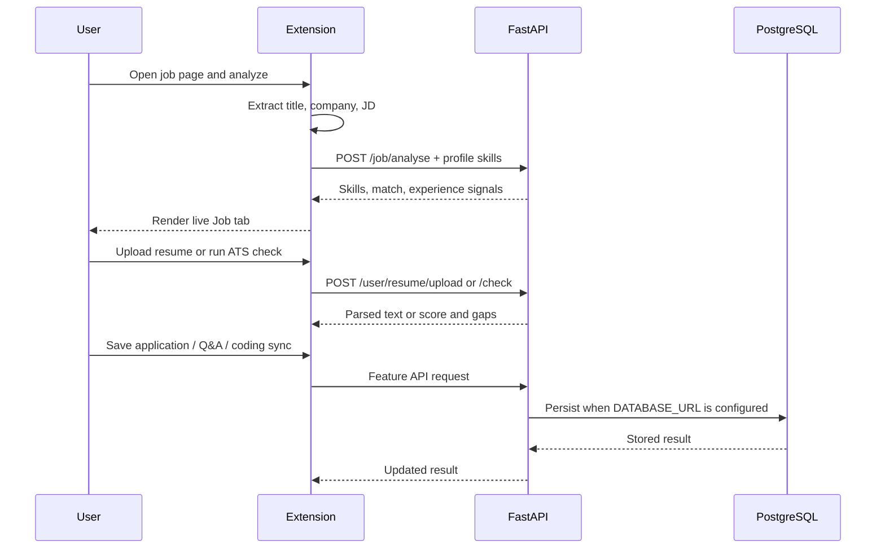

# Drive2Hire Architecture

## Components

| Layer | Tech | Role |
|-------|------|------|
| Extension UI | HTML/CSS/JS | Side panel FocusBar (Job / Company / Coding tabs) |
| Content scripts | Plain JS | Read job/coding pages (Phase 2+) |
| Service worker | Plain JS | Side panel behavior, message routing, API calls |
| Backend | FastAPI (Python) | REST JSON APIs |
| Database | PostgreSQL via SQLAlchemy async | Durable users, skills, Q&A, companies, sessions, applications |

## Runtime Architecture

## Authentication and storage boundary

The current sign-in experience is local-first. Google OAuth verifies the account and the extension stores the active profile in `chrome.storage.local`, but the backend does not yet issue a session or associate API writes with a user ID. Job analysis and UI preferences therefore work without PostgreSQL; persistent multi-device data does not.

## Feature flow

The extension refreshes backend health every 15 seconds and updates its panel when Chrome storage changes. The backend currently runs in a useful degraded mode without PostgreSQL, while database-backed features need `DATABASE_URL` and a reachable PostgreSQL instance.

## Current gaps

- Backend authentication is verification-only; there is no issued session/JWT or user-scoped persistence.
- Most extension actions are local storage actions, so data does not follow a user to another browser or device.
- Coding sync is public-profile fetching, not authenticated platform integration; some platform adapters remain limited.
- Company salary and leadership data are not sourced yet.
- The extension is load-unpacked only. Cross-browser packaging and store distribution are not configured.

## Local-first

No paid services required for MVP development. Deployment options (Render, Railway, Chrome Web Store) are documented for later phases only.
