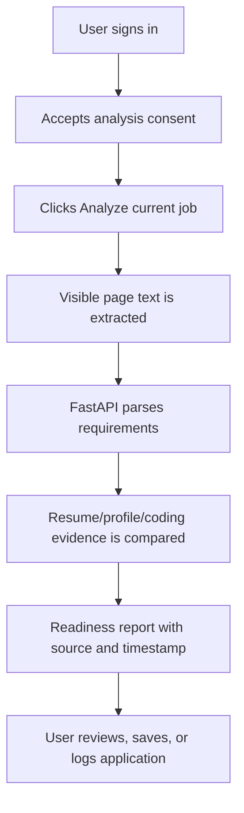

# Drive2Hire Product Status

## Product promise

Drive2Hire provides an explainable, real-time readiness assessment for a supported job page by comparing the active job description with user-consented resume, profile, and public coding evidence. It does not predict selection probability and does not invent missing data.

## Current end-to-end flow

The analysis is live when the user clicks the button. The panel refreshes backend health every 15 seconds and re-renders when local or session storage changes. It is intentionally not background tracking.

## Complete locally

- Home-only personalized greeting.
- Dark side-panel interface with actionable empty states.
- Job title, company, location, work mode, employment type, experience, source URL, and extraction confidence.
- Required and preferred skill groups.
- Explainable readiness score: 60% required-skill match plus 40% overall evidence coverage.
- Matched, missing, and weak evidence findings with priority and suggested action.
- PDF, DOCX, and TXT resume text extraction.
- Resume-JD matching, missing sections, keyword gaps, formatting flags, and suggestions.
- Public coding profile sync with source, errors, and retrieval timestamp.
- Company information limited to facts found on the current page.
- Saved job and application snapshots.
- Local privacy consent, resume deletion, and local profile deletion.

## Known boundaries

- Without `DATABASE_URL`, the API is usable but PostgreSQL persistence is disabled.
- Google sign-in currently verifies the account but does not issue a backend session.
- Local Chrome storage means data does not follow the user to another browser or device.
- Coding integrations expose reliable public profile fields; topic history is not yet available for every platform.
- Company salary, leadership, and interview claims are intentionally unavailable unless a reliable source is added.

## Browser distribution

Today the extension is a Chrome load-unpacked build. A person can use it locally by selecting the `extension/` folder in `chrome://extensions` with Developer Mode enabled. Other Chromium browsers may work after testing their side-panel and identity APIs. Firefox requires a separate manifest/sidebar adapter. Normal one-click installation for other people requires publishing a store build and hosting the backend.

## Next implementation order

1. Add backend JWT/session issuance and user-scoped persistence.
2. Add editable requirements and project evidence records.
3. Implement one reliable LeetCode topic/activity integration.
4. Add focused browser tests for supported job pages and resume failures.
5. Deploy the API and publish a Chrome build.